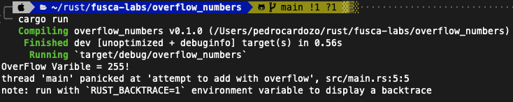
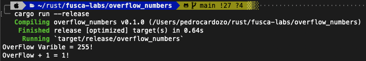

## Integer Overflow

> Como se comporta o rust quando inteiros como u8, u16, u32, u64, u128 e usize sofrem um overflow?

## Comportamentos possiveis:

### Debug Mode:

Quando o codigo e compilado neste modo sera feito uma validacao de overflow em runtime, caso exista alguma sera retornado um `panic!` (e o codigo sera parado).

Ex:

### Release Mode:

No cenario de build de release o comportamento e diferente em runtime, caso o overflow aconteca a validacao que causa `panic!` nao ira ocorrer, e sera aplicado um warpping do valor maximo chamado `two’s complement wrapping`.

Ex:

